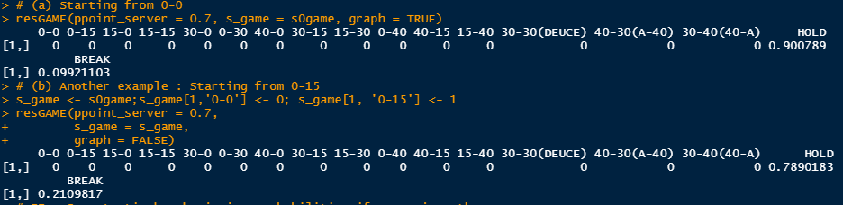
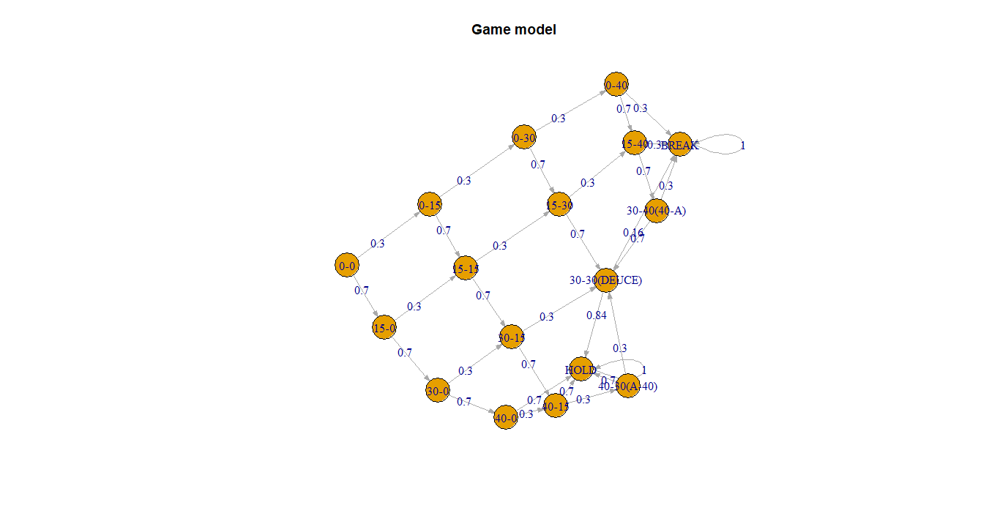
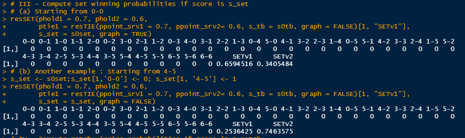

# Markov4Tennis
:information_source: An R script to modelize a tennis match with Markov chains. Want to know more about Markov Chains ? See [1] for a quick visual overview :100::100:. To use this work, just open the *Markov.R* script :thumbsup:. 

:information_source: Medium article : https://medium.com/analytics-vidhya/modelizing-a-tennis-match-with-markov-chains-b59ca2b5f5bf 

:information_source: Functionalities :
- Compute winning probabilities for a game, a set, a tie-break and a match
- Compute winning probabilities for already started match
- Compute final score probabilities in terms of set
- Display Markov Chain models

:information_source: Functions overview : <br />
Function | Purpose | Working ? 
------------ | ------------- | ------------- 
determiMM() | Compute match winning probabilities from any score| :heavy_check_mark: 
resGAME() | Compute game winning probabilities | :heavy_check_mark: 
resTIE() | Compute tie-break winning probabilities | :heavy_check_mark: 
resSET() | Compute set winning probabilities |:heavy_check_mark: 
resMATCH() | Compute exact set scores probabilities | :heavy_check_mark: 

:information_source: The main functions which you can use are the following one : <br />
```R
1.determiMM(ppoint_srv1 = 0.7, ppoint_srv2 = 0.6, setscore = '1-0', gamescore = '0-3', 
           s0match, s0set, s0game, s0tb)
2.resGAME(ppoint_server = 0.7, s_game = s0game, graph = TRUE) 
3.resTIE(ppoint_srv1 = 0.7, ppoint_srv2= 0.6, s_tb = s0tb, graph = TRUE)
4.resSET(phold1 = 0.7, phold2 = 0.6, 
       ptie1 = resTIE(ppoint_srv1 = 0.7, ppoint_srv2= 0.6, s_tb = s0tb, graph = FALSE)[1, "SETv1"], 
       s_set = s0set, graph = TRUE)
5.resMATCH(pset_v1 = 0.7, s_match = s0match, graph = TRUE)
```
:information_source: Outputs of the functions (extra-documentation can be found in the *functions.R* script): </br> 
1.determiMM()</br> 
</br> 
2.resGAME()</br> 
</br> 
</br> 
3.resTIE()</br> 
</br> 
</br> 
4.resSET()</br> 
</br> 
</br> 
5.resMATCH()</br> 
</br> 
</br> 

</br>

:information_source: Please report any bug/issue in the *issues* section or directly at sebcararo@hotmail.fr. Any feedback is really appreciated :speech_balloon: :+1:. </br>


------------------------------------------------------------------------------------------------------------------------------------------------------------------------------
------------------------------------------------------------------------------------------------------------------------------------------------------------------------------
------------------------------------------------------------------------------------------------------------------------------------------------------------------------------
------------------------------------------------------------------------------------------------------------------------------------------------------------------------------
You can also have a look at the *functions.py* source code in order to understand the mechanics and eventually adapt the code to your own purpose. I suggest the reader to start by reading lines from n°722 to the end, because these functions are the most speaking ones and that I commented them to clarify the inputs/outputs and use. 

Markov chains are a great tool for modelizing all many kinds of stochastic process, including statistical physics, information theory, statistics, finance, but also sports modelizations. Several bookmakers use related techniques to predict odds for in the sports betting industry. 

Future work :
- Adapt the code to various sports
- Create evolving models of Markov Chains (i.e. if the player 1 won the first set then he might be less likely to win the second set, hence we could adapt the model depending on the result of the first games)

[1] https://setosa.io/ev/markov-chains/ <br />
